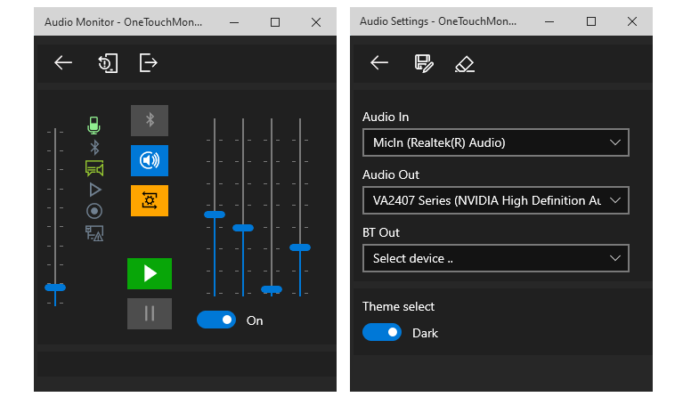

# OneTouch Audio Input Monitor (UWP)
### About 

`One Touch Audio Monitor` is designed to quickly switch input audio devices to selected output audio devices with one touch.  For example, it is relevant for quickly listening to a microphone, usually on headphones connected both with a wire and with a Bluetooth connection.

Supports all kinds of audio input and output devices, including Bluetooth devices.

Activation in the mode of output audio devices, or Bluetooth audio devices is provided.

When activated, the application automatically connects the pre-selected output device if it is connected and available.

To connect, you also need the availability of the selected input device.  If no input or output devices are available, the application goes into standby mode and connects when the correct devices are connected.
 
### Installation:

You need to enable Developer mode on your computer.  

- Open Settings.  
- Click on Update & security.  
- Click on For developers.  
- Under Use developer features enable Developer mode.  
- Enable Developer Mode in Windows `10`/`11`, and Click `Yes`.  
- Restart your computer to complete the task.  
- Download latest [release](https://github.com/ClaudiaCoord/OneTouchAudioMonitor/releases/download/1.0.8.0/OneTouchMonitor_1.0.8.0.zip) `OneTouchAudioMonitor_X.X.X.X.zip`.  
- Unzip file.  
- Run shell as Administrator.  
- Type in the command line `.\Install.cmd` or `powershell .\Install.ps1`  
- Done.  

Check the windows start menu, there should be a shortcut named `OneTouch Monitor`..  

### Interfaces screens:

 
